+++
draft = false
title = "郑赏宫廷点心 包装设计"
date = "2019-03-01T15:07:55+08:00"
image = "/portfolio/portfolio/palace-snacks/1.jpg"
showonlyimage = false
+++

喜鹊报喜，出门见喜寓意吉祥。因此用喜鹊的形象元素，另外采用扁平化图形元素及复古传统宫廷配色，既符合如今图形扁平化趋势，又符合项目定位，传统又新颖。三种配色方案可代表不同口味的糕点，满足系列产品的包装要求。

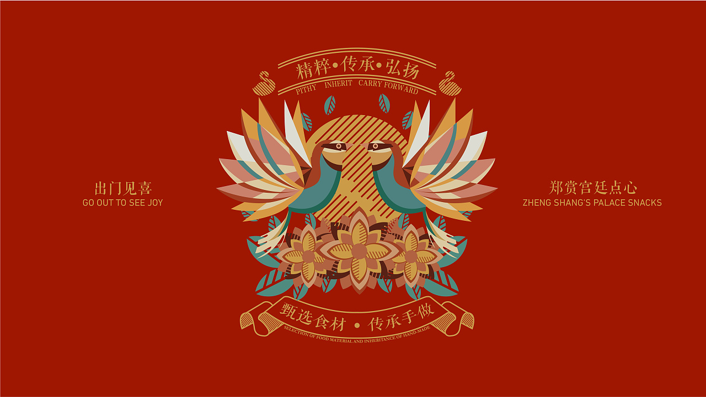

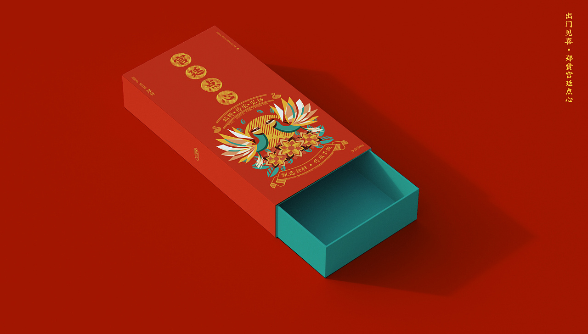

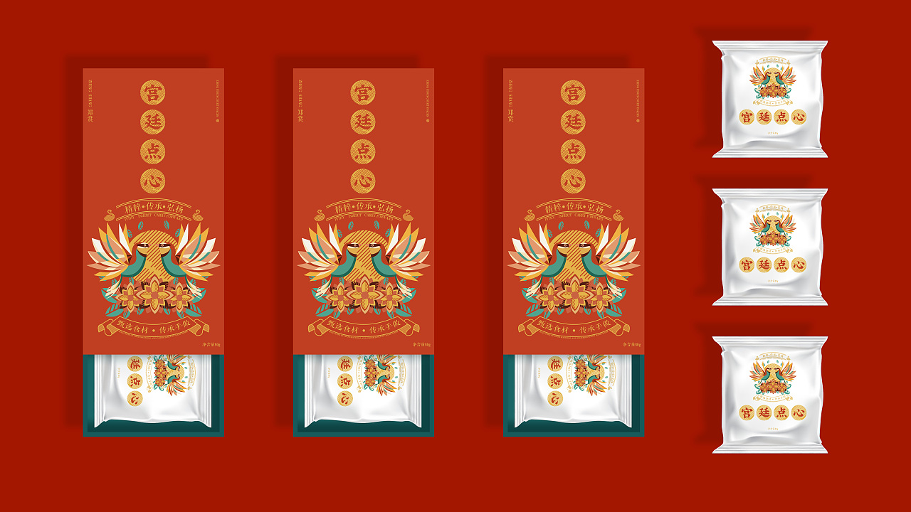

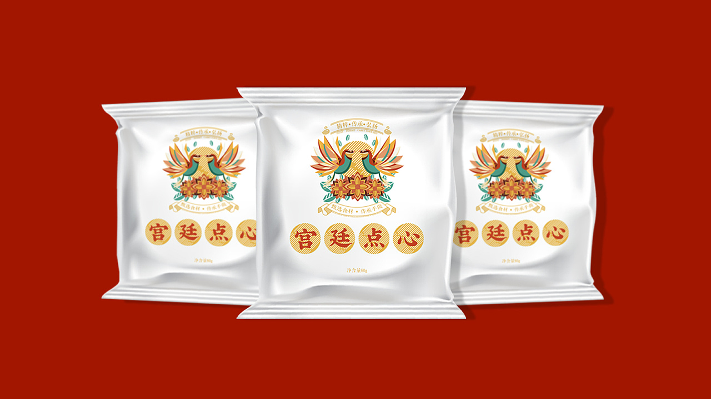

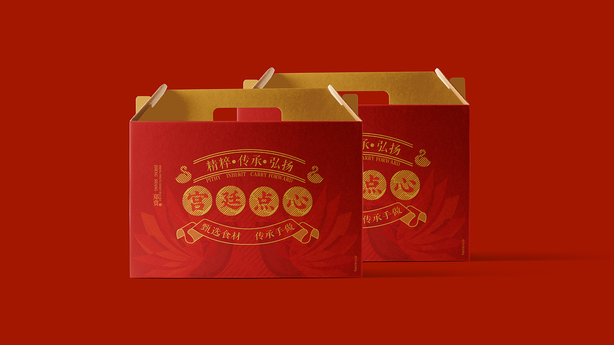

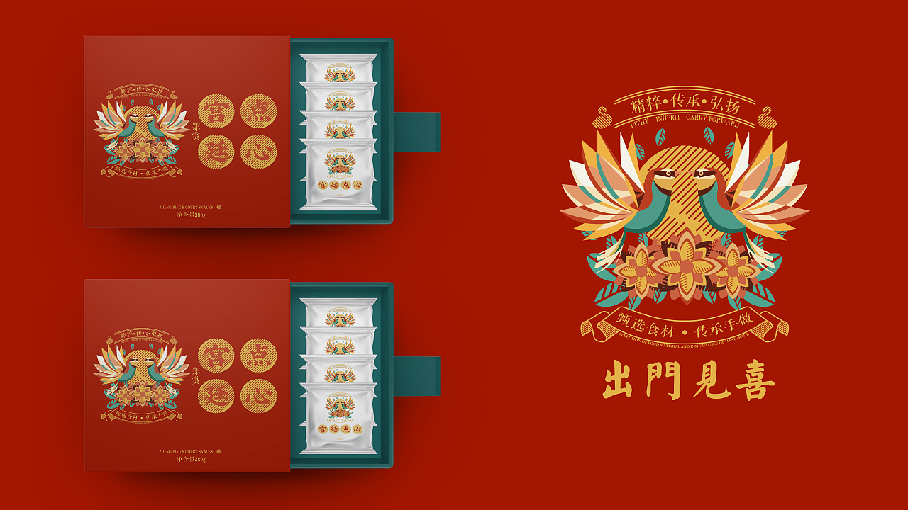

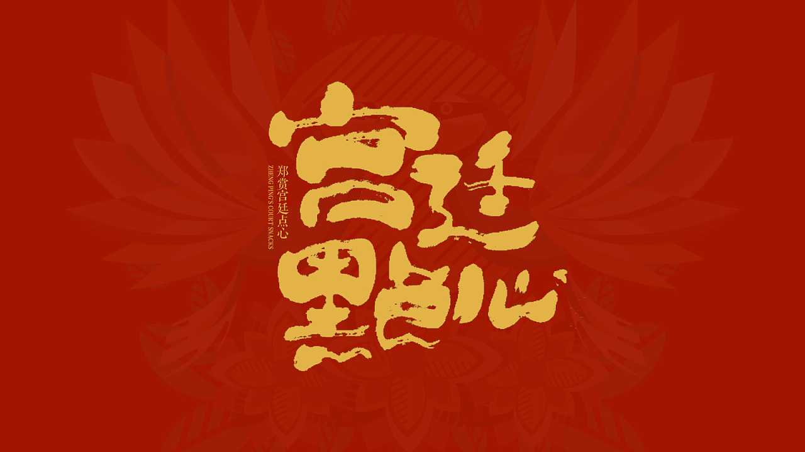

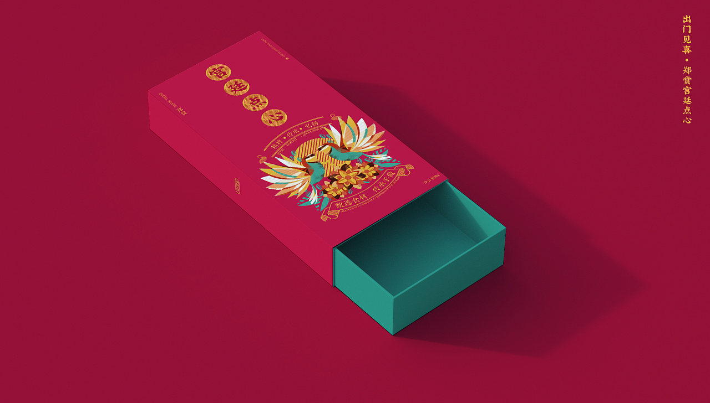

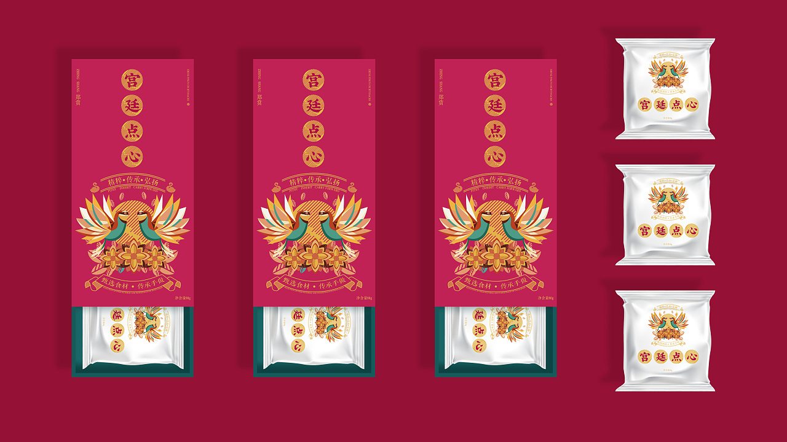

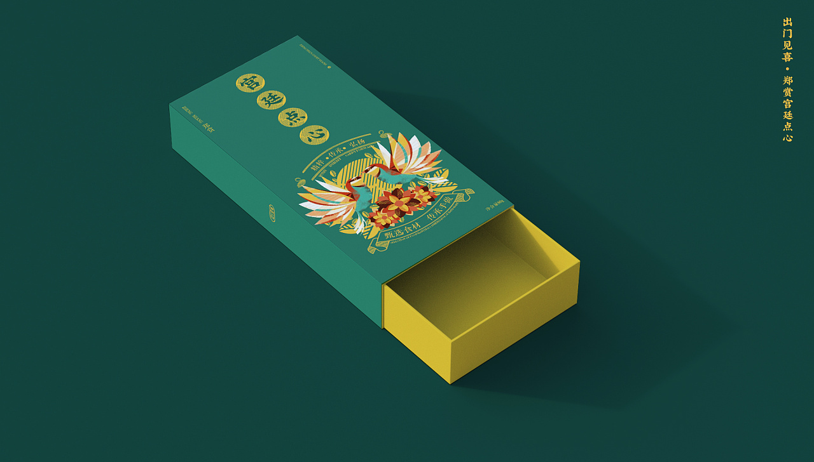

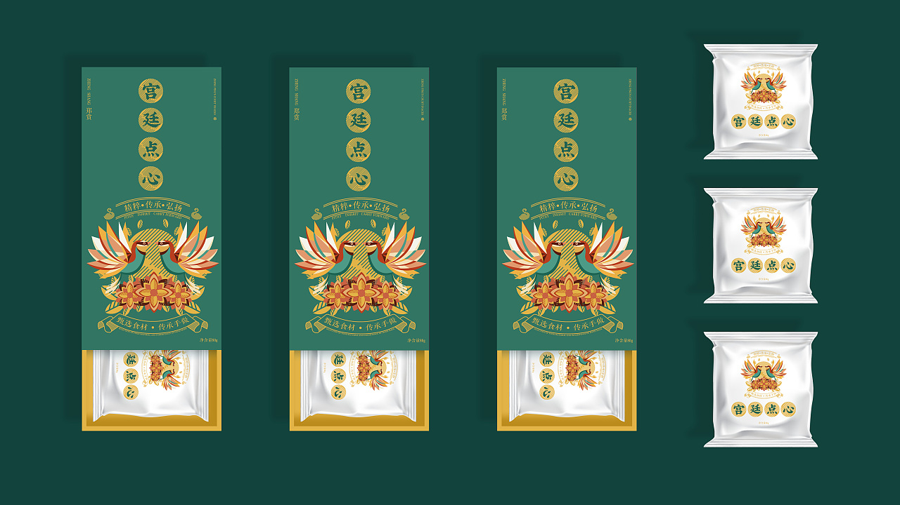