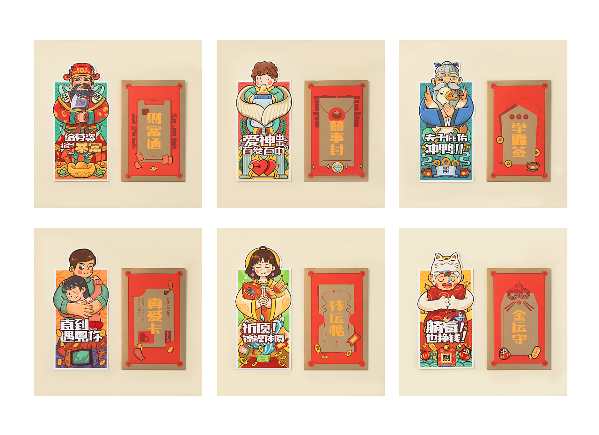
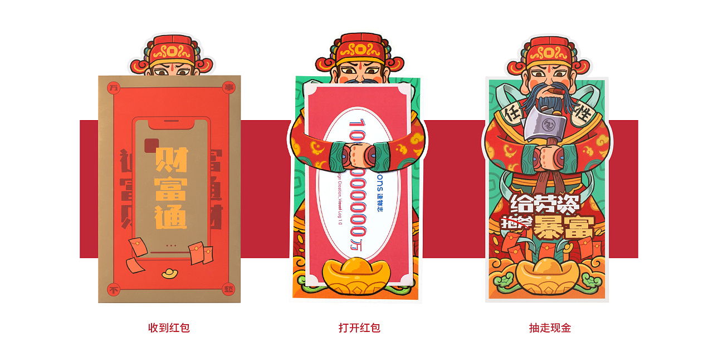
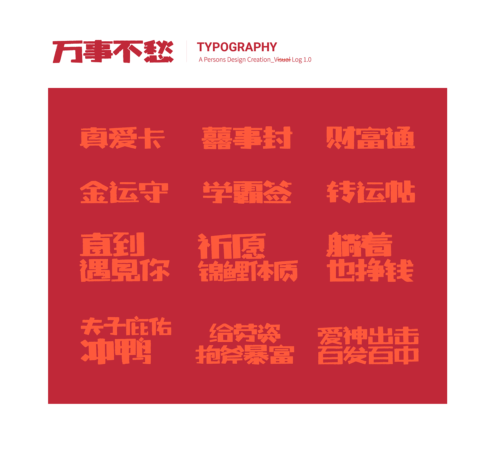
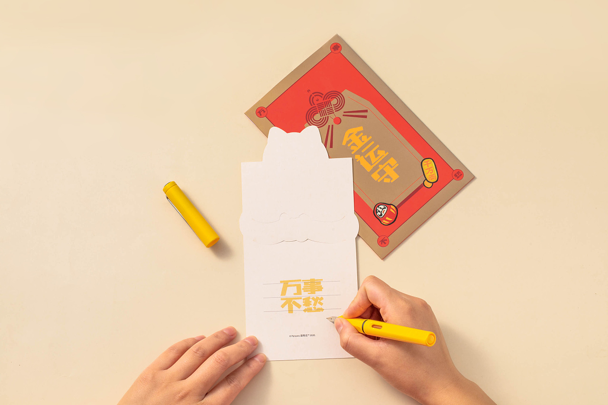

+++
draft = false
title = "万事不愁红包系列"
date = "2020-04-26T15:07:55+08:00"
image = "/portfolio/portfolio/red-envelopes/9.jpg"
showonlyimage = false
+++

重新定义红包，向内思考红包的意义、使用的价值以及潜在效果。从当代人的生活习惯反思心意的表达方式、万能的应用场景以及情感的互动体验，这一切都藏在“万事不愁”红包系列的设计之中。

我们知道，红包作为人情礼赠，其设计历来惯以“钱”的概念为中心，而Persons Design认为
红包本身应当是有温度的。钱仅是心意的代劳之物，其背后的东西更值得思考与珍视。

采用拥抱的形式，以温暖之姿将“钱”作为装饰与“红包”融合，并将“祝福”的核心隐于拥抱之下，也就是“钱的背后”，如此一来，塞钱抽钱之间，赠者与受者自然实现了一次“钱之外”的心意互动，以及对“钱”本身的一次趣味反思。

